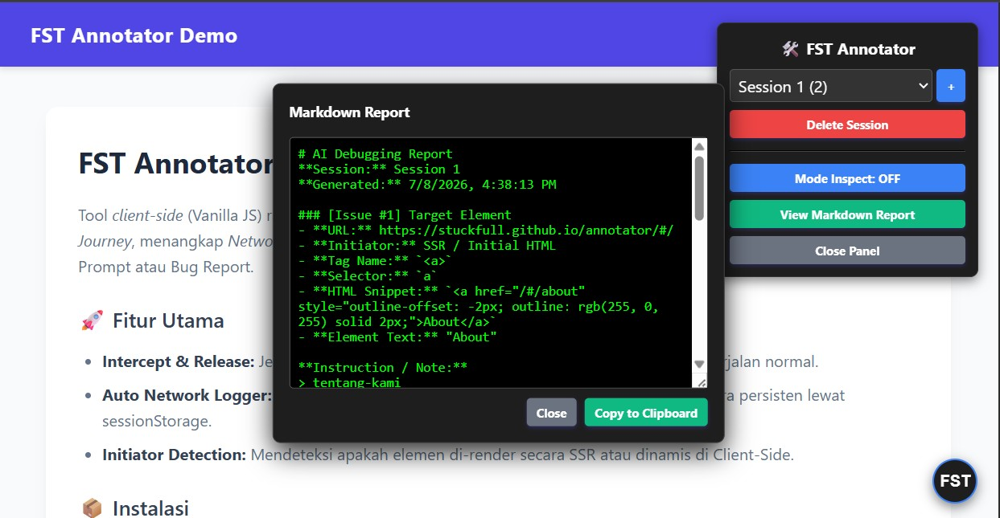

# FST Annotator

[](https://www.jsdelivr.com/package/gh/stuckfull/annotator)

Tool *client-side* (Vanilla JS) ringan untuk *Man-In-The-Middle Debugging*. Mencegat event klik, mencatat *User Journey*, menangkap *Network Logs* (Fetch & XHR) secara *background*, lalu merangkumnya dalam Markdown untuk AI Prompt atau Bug Report.



## 🚀 Fitur Utama
- **Intercept & Release:** Jeda interaksi asli -> Tulis Anotasi -> Teruskan event agar web berjalan normal.
- **Auto Network Logger:** Merekam payload & response dari aktivitas API (SPA/SSR) secara persisten lewat `sessionStorage`.
- **Initiator Detection:** Mendeteksi apakah elemen di-render secara SSR atau dinamis di Client-Side.

## 📦 Instalasi
Tambahkan script ini ke `<head>` HTML Anda:
```html
<script src="https://cdn.jsdelivr.net/gh/stuckfull/annotator@main/annotator.js"></script>
```
*Atau, paste isi `annotator.js` ke Browser Console pada web mana pun untuk debugging instan.*

## 🔗 Demo
[Coba Live Demo SPA](https://stuckfull.github.io/annotator/)

---

## 📝 Contoh Report
Report ini langsung di-_generate_ oleh FST dan di-_copy_ ke clipboard Anda:

```markdown
# AI Debugging Report
**Session:** Session 1
**Generated:** 08/07/2026, 15:30:00

### [Issue #1] Target Element
- **URL:** https://example.com/checkout
- **Initiator:** Client-Side (Dynamically Rendered)
- **Tag Name:** `<button>`
- **Selector:** `button#submit-order.btn.btn-primary`
- **HTML Snippet:** `<button id="submit-order" class="btn btn-primary" data-item="123">Bayar Sekarang</button>`
- **Element Text:** "Bayar Sekarang"

**Instruction / Note:**
> Tombol payment stuck loading setelah user memilih metode transfer bank.

**User Journey (Before Issue):**
1. [15:29:45] **PAGE_LOAD** -> `/checkout`
2. [15:29:48] **CLICK** -> `input[type="radio"]#bank-transfer`
3. [15:29:50] **CLICK** -> `button#submit-order.btn.btn-primary`

**Recent Network API Logs:** 
```json
[
  {
    "time": "15:29:51",
    "url": "/api/payment/select",
    "method": "POST",
    "reqBody": "{\"method\":\"bank_transfer\",\"amount\":50000}",
    "status": 500,
    "resBody": "{\"error\":\"Internal Server Error\"}"
  }
]
```
```
